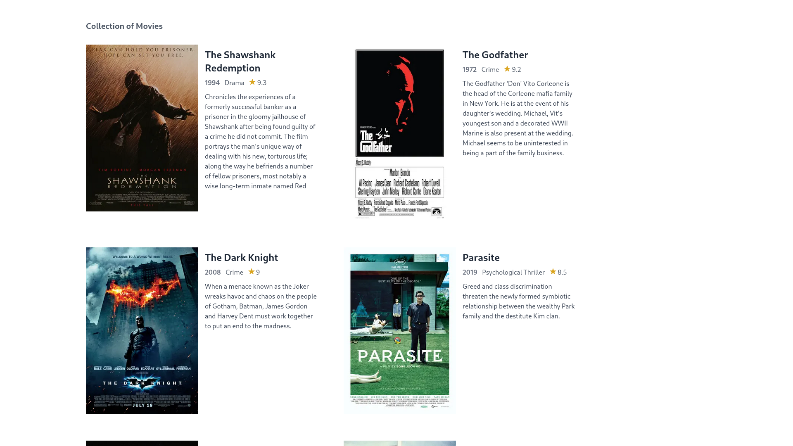

# FLASK MOVIEDB



This project is a Flask-based web application that explores JWT authentication and middlewares. The backend handles user authentication, enforcing secure login/logout mechanisms, and applying middleware for request validation and logging. This setup provides a structured way to learn about jwt based authentication, middleware functions, and nosql database in a Flask environment.

⚠️ This project is created solely for fun and learning

## TechStack

- Flask
- Tailwindcss
- Mongodb

## Installation

### Prerequisites

- Python 3.11+
- pip (Python package installer)
- Nodejs (v18.19.0 or above)
- npm (9.2.0) or above

### Database Setup

Required a mongodb database local or cloud.

The Project required two MongoDB databases:

1. **auth**
   - Contains a `users` collection.
   - Used for autentication and user management

2. **movies**
   - Contains a `movie` collection.
   - Used for storing and retrieving movie-related data

### Steps

1. Clone the repository:

   ```bash
   git clone https://github.com/blueorionn/Flask-MovieDb.git
   cd Flask-MovieDb
   ```

2. Create and activate a virtual environment:

   ```bash
   python -m venv .venv
   source .venv/bin/activate   # On Windows: venv\Scripts\activate
   ```

3. Install the dependencies:

   ```bash
   pip install -r requirements.txt
   ```

4. Export variables:

   ```bash
   export PYTHONDONTWRITEBYTECODE=1
   export FLASK_ENV="development" # FLASK_ENV=production for production environment
   export SECRET_KEY="your-secret-key"
   export MONGO_URI="mongodb+srv://<username>:<password>@<host>/?authSource=admin&retryWrites=true&w=majority&appName=default"
   ```

5. Run the Flask app:

   ```bash
   python wsgi.py
   ```

6. Open the app in your browser at `http://127.0.0.1:8000/`.

## License

This project is released under the MIT License.
