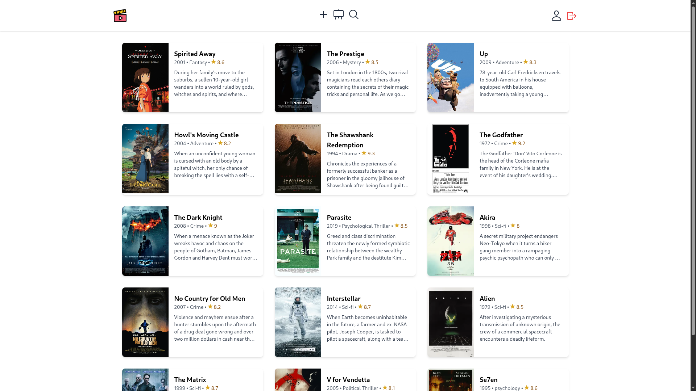

# Cinexa



This project is a Flask-based web application that explores JWT authentication, middlewares and nosql database integration built only for learning

## Tech Stack

- **Backend:** Flask 3.1, PyJWT, bcrypt, PyMongo
- **Frontend:** Tailwind CSS 3.4, Jinja2 templates
- **Database:** MongoDB (single db, two collections)

## Table of Contents

- [Prerequisites](#prerequisites)
- [Quick Start](#quick-start)
- [Project Structure](#project-structure)
- [Configuration](#configuration)
- [Default Credentials](#default-credentials)
- [License](#license)

## Prerequisites

- Python 3.11+
- Node.js 18.19+ and npm 9.2+
- MongoDB (local or [Atlas](https://mongodb.com/atlas) free tier)

## Quick Start

### 1. Clone

Clone the repository:

```bash
git clone https://github.com/blueorionn/cinexa.git
cd cinexa
```

### 2. Python environment

```bash
python -m venv .venv
source .venv/bin/activate   # On Windows: venv\Scripts\activate
pip install -r requirements.txt
```

### 3. Frontend dependencies

```bash
npm install
npm run buildCss
```

### 4. Configure environment

cp `.env.example` `.env`
Then edit `.env` with your MongoDB URI and a random **`SECRET_KEY`**

### 5. Load seed data

Import the seed users and movies into your database:

```bash
python scripts/load_data.py data/user.json
python scripts/load_data.py data/movies.json
```

To re-import from scratch (drops existing data first):

```bash
python scripts/load_data.py data/user.json --drop
python scripts/load_data.py data/movies.json --drop
```

You can also register additional users via the command line:

```bash
python scripts/register_user.py -fn Bob -u bob -p secret1234
python scripts/register_user.py -fn Alice -u alice -p secret5678 --role admin
```

### 6. Run

```bash
python wsgi.py
```

## Project Structure

```text
Cinexa/
├── wsgi.py                  # App entry point (loads .env, creates app)
├── cinexa/
  ├── init.py          # App factory
  ├── settings.py          # Configuration classes
  ├── extensions.py        # Flask extensions (CORS, MongoDB)
  ├── middleware.py        # Before-request auth middleware
  ├── utils.py             # Utility functions
  ├── views.py             # Base blueprint (robots.txt, favicon)
  ├── auth/
  │   ├── views.py         # Login, profile pages
  │   └── func.py          # JWT create/decode, user auth
  ├── core/
  │   ├── views.py         # Movie CRUD pages
  │   └── func.py          # Database queries for movies
  ├── templates/           # Jinja2 templates
  ├── static/              # CSS, public assets
  └── assets/              # Uploaded movie posters
├── data/
  ├── user.json            # Seed data: users
  └── movies.json          # Seed data: movies
├── Dockerfile
├── requirements.txt
└── package.json
```

## Configuration

All configuration is via environment variables (loaded from `.env`):

| Variable | Description |
| ---------- | ------------- |
| `MONGO_URI` | MongoDB connection string. Include the database name in the URI path (e.g. `mongodb://host/mydb`) |
| `SECRET_KEY` | Secret key for JWT signing. Generate one: `python -c "import secrets; print(secrets.token_hex(32))"` |
| `FLASK_ENV` | `"development"` (default), `"production"`, or `"testing"` |
| `PYTHONDONTWRITEBYTECODE` | Set to `1` to suppress `__pycache__` |

### Database Schema

**`auth` collection** — one document per user:

| Field | Type | Description |
| ------- | ------ | ------------- |
| `_id` | ObjectId | MongoDB default ID |
| `id` | UUID v4 | Unique user identifier |
| `username` | string | Login name (unique) |
| `password` | string | bcrypt hash |
| `firstname` | string? | First name |
| `lastname` | string? | Last name |
| `role` | string | `"admin"` or `"user"` |
| `created_at` | ISODate | Account creation |

**`movie` collection** — one document per movie:

| Field | Type | Description |
| ------- | ------ | ------------- |
| `_id` | ObjectId | MongoDB default ID |
| `id` | UUID v4 | Unique movie identifier |
| `created_by` | UUID v4 | References `auth.id` |
| `title` | string | Movie title |
| `release_year` | int | Year of release |
| `rating` | float | Rating (0–10) |
| `genre` | string | Genre label |
| `poster` | string | Poster filename in `cinexa/assets/` |
| `description` | string | Plot summary |
| `is_private` | boolean | Public or user-private |

## Default Credentials

| Username | Password | Role |
| ---------- | ---------- | ------ |
| `admin` | `password` | admin |
| `user` | `password` | user |

These users are created by importing `data/user.json` during setup.

## License

This project is released under the MIT License. See [LICENSE](LICENSE).
